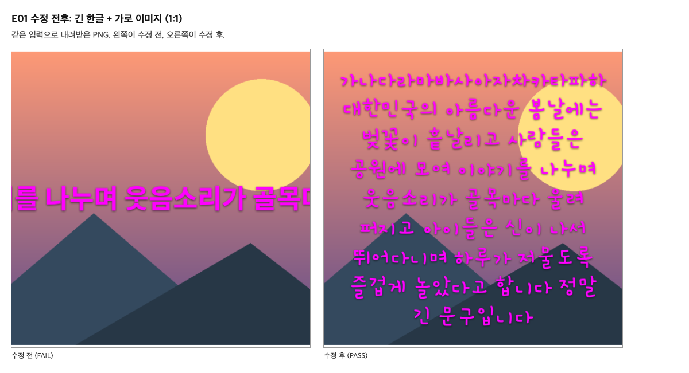
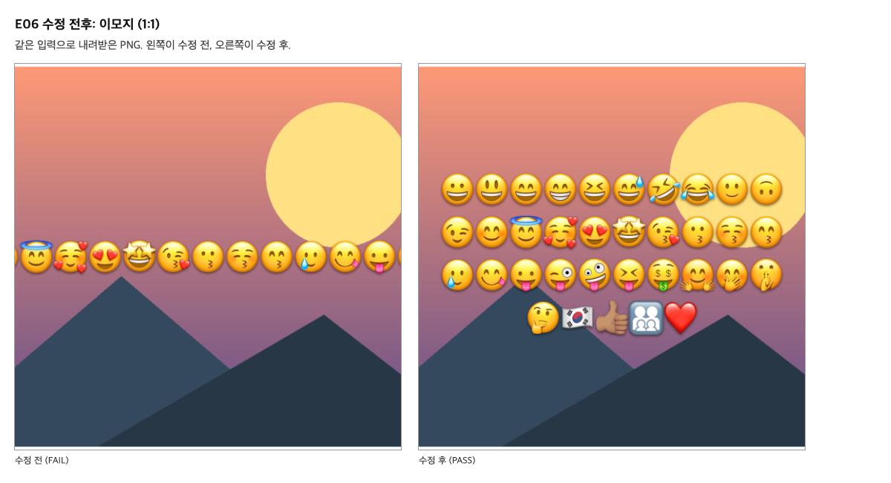
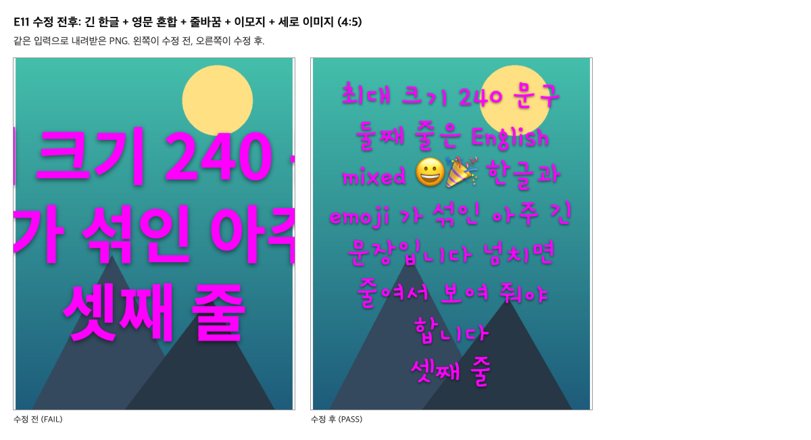

# 3단계 검사표: 극단 입력 12건

각 검사는 미리보기와 내려받은 PNG를 둘 다 확인한다. 입력과 예상값은 코드를 고치기 전에 확정했고(삭제한 tests/stage3-cases.mjs에 저장했고, 아래 표의 "예상값" 열이 그 내용이다), 결과를 본 뒤 바꾸지 않았다.
수정 전 결과는 docs/stage3-before.json에 고정되어 있다. (이 결과는 자동 점검 스크립트로 만들었으나, 스크립트는 저장소에서 삭제했다. 앱을 고치면 결과가 어긋날 수 있다.)

## 공통 예상값

- P1: 오류 없이 PNG가 내려받아지고 크기가 화면비와 같다.
- P2: 미리보기 캔버스와 내려받은 파일의 픽셀이 완전히 같다.
- P3: 문구 입력칸의 내용과 크기 슬라이더 값이 그대로다.
- P4 (C16): 검사 뒤 지원하지 않는 파일 3종(가짜 PNG, GIF, 손상 PNG)을 넣어도 이미지, 문구, 위치, 크기, 색이 그대로이고 거부 이유가 표시된다.
- P5: 문구가 있으면 글자가 닿은 영역이 안전 영역(가로 폭의 4%~96%, 세로 높이의 2%~98%) 안에 있다.

## 12건 검사표

| ID | 입력 종류 | 화면비 / 이미지 / 크기 | 문구 | 예상값 | 수정 전 | 수정 후 |
|---|---|---|---|---|---|---|
| E01 | 긴 한글, 가로 이미지 | 1:1 / 가로 PNG 1200×800 / 96 | `가나다라마바사아자차카타파하 대한민국의 아름다운 봄날에는 벚꽃이 흩날리고 …` | P1~P5. 폭에 맞춰 2줄 이상으로 줄바꿈된다. 높이가 넘치므로 글꼴이 줄어 알림이 화면에 표시된다(슬라이더는 96 유지). | **FAIL** | PASS |
| E02 | 긴 한글, 세로 이미지 | 9:16 / 세로 JPEG 800×1200 / 96 | `가나다라마바사아자차카타파하 대한민국의 아름다운 봄날에는 벚꽃이 흩날리고 …` | P1~P5. 2줄 이상으로 줄바꿈된다. | **FAIL** | PASS |
| E03 | 영문 혼합, 가로 이미지 | 4:5 / 가로 PNG 1200×800 / 120 | `Hello 세계 World 2026 밈 카드 STUDIO Lorem ip…` | P1~P5. 2줄 이상으로 줄바꿈된다. | **FAIL** | PASS |
| E04 | 영문 혼합(공백 없는 긴 단어), 가로 이미지 | 1:1 / 가로 PNG 1200×800 / 96 | `Supercalifragilisticexpialidocious_ABCDE…` | P1~P5. 공백이 없어도 글자가 캔버스 밖으로 나가지 않고 2줄 이상으로 나뉜다. | **FAIL** | PASS |
| E05 | 줄바꿈 | 1:1 / 가로 PNG 1200×800 / 96 | `첫 줄↵↵셋째 줄↵넷째 줄` | P1~P5. 글자가 있는 줄이 3개다(가운데 빈 줄이 유지된다). 첫 줄과 셋째 줄의 위쪽 간격은 줄 높이(크기×1.25)의 2배 ±15%다. 글꼴 축소 알림은 없다. | PASS | PASS |
| E06 | 이모지 | 1:1 / 가로 PNG 1200×800 / 96 | `😀😃😄😁😆😅🤣😂🙂🙃😉😊😇🥰😍🤩😘😗😚😙…` | P1~P5. 이모지가 잘리거나 깨지지 않고 캔버스 안쪽 안전 영역에 모두 들어간다. | **FAIL** | PASS |
| E07 | 빈 문구 | 1:1 / 가로 PNG 1200×800 / 96 | `(빈 문구)` | P1~P4. 문구가 없으므로 글자가 그려지지 않는다(문구 없는 캔버스와 같다). 내려받기는 오류 없이 된다. | PASS | PASS |
| E08 | 세로 이미지 | 1:1 / 세로 JPEG 800×1200 / 96 | `세로 이미지 잘림` | P1~P5. 세로 이미지를 1:1에 채우면 위아래가 잘리고 좌우 흰 테두리는 보인다. 미리보기와 파일이 같다. | PASS | PASS |
| E09 | 가로 이미지 | 9:16 / 가로 PNG 1200×800 / 96 | `가로 이미지 잘림` | P1~P5. 가로 이미지를 9:16에 채우면 좌우가 잘리고 위아래 흰 테두리는 보인다. 미리보기와 파일이 같다. | PASS | PASS |
| E10 | 투명 이미지 | 1:1 / 투명 PNG 600×600 / 96 | `투명 이미지` | P1~P5. 이미지의 투명 영역(왼쪽 절반)이 파일에서도 투명(알파 0)이고, 불투명 영역(오른쪽 절반)은 알파 255다. 배경색을 채우지 않는다. | PASS | PASS |
| E11 | 긴 한글, 영문 혼합, 줄바꿈, 이모지, 세로 이미지 | 4:5 / 세로 JPEG 800×1200 / 240 | `최대 크기 240 문구↵둘째 줄은 English mixed 😀🎉 한글…` | P1~P5. 최대 크기(240)에서도 글자가 잘리지 않고 안전 영역에 들어간다. 글꼴이 줄어 알림이 표시되고 슬라이더는 240을 유지한다. | **FAIL** | PASS |
| E12 | 긴 한글, 투명 이미지 | 4:5 / 투명 PNG 600×600 / 96 | `가나다라마바사아자차카타파하 대한민국의 아름다운 봄날에는 벚꽃이 흩날리고 …` | P1~P5. 긴 문구가 투명 이미지 위에서도 안전 영역에 들어가고, 이미지의 투명 영역은 파일에서 투명(알파 0)으로 남는다. | **FAIL** | PASS |

## 항목별 실제 결과 (수정 후)

### E01 PASS

- PASS P1: PNG 1080×1080
- PASS P2: 다른 픽셀 0건
- PASS P3: 문구 유지, 슬라이더 96
- PASS P5: 글자 영역 x 59~1023 (안전 43~1037), y 87~1004 (안전 22~1058)
- PASS 줄바꿈: 글자 줄 9개 (기대 2개 이상)
- PASS 축소 알림: 알림: 문구가 길어 크기 96 대신 86로 줄여 그렸습니다. 내려받는 파일도 같습니다.
- PASS P4: fake-image.png: 유지/이유 표시, unsupported.gif: 유지/이유 표시, corrupt.png: 유지/이유 표시

### E02 PASS

- PASS P1: PNG 1080×1920
- PASS P2: 다른 픽셀 0건
- PASS P3: 문구 유지, 슬라이더 96
- PASS P5: 글자 영역 x 81~1002 (안전 43~1037), y 395~1543 (안전 38~1882)
- PASS 줄바꿈: 글자 줄 10개 (기대 2개 이상)
- PASS P4: fake-image.png: 유지/이유 표시, unsupported.gif: 유지/이유 표시, corrupt.png: 유지/이유 표시

### E03 PASS

- PASS P1: PNG 1080×1350
- PASS P2: 다른 픽셀 0건
- PASS P3: 문구 유지, 슬라이더 120
- PASS P5: 글자 영역 x 59~1018 (안전 43~1037), y 264~1109 (안전 27~1323)
- PASS 줄바꿈: 글자 줄 7개 (기대 2개 이상)
- PASS P4: fake-image.png: 유지/이유 표시, unsupported.gif: 유지/이유 표시, corrupt.png: 유지/이유 표시

### E04 PASS

- PASS P1: PNG 1080×1080
- PASS P2: 다른 픽셀 0건
- PASS P3: 문구 유지, 슬라이더 96
- PASS P5: 글자 영역 x 61~1018 (안전 43~1037), y 392~699 (안전 22~1058)
- PASS 줄바꿈: 글자 줄 3개 (기대 2개 이상)
- PASS P4: fake-image.png: 유지/이유 표시, unsupported.gif: 유지/이유 표시, corrupt.png: 유지/이유 표시

### E05 PASS

- PASS P1: PNG 1080×1080
- PASS P2: 다른 픽셀 0건
- PASS P3: 문구 유지, 슬라이더 96
- PASS P5: 글자 영역 x 415~658 (안전 43~1037), y 314~771 (안전 22~1058)
- PASS 빈 줄 유지: 글자 줄 3개, 1~2번째 줄 간격 240px (기대 240±15%), 축소 알림 없음
- PASS P4: fake-image.png: 유지/이유 표시, unsupported.gif: 유지/이유 표시, corrupt.png: 유지/이유 표시

### E06 PASS

- PASS P1: PNG 1080×1080
- PASS P2: 다른 픽셀 0건
- PASS P3: 문구 유지, 슬라이더 96
- PASS P5: 글자 영역 x 61~1019 (안전 43~1037), y 307~763 (안전 22~1058)
- PASS P4: fake-image.png: 유지/이유 표시, unsupported.gif: 유지/이유 표시, corrupt.png: 유지/이유 표시

### E07 PASS

- PASS P1: PNG 1080×1080
- PASS P2: 다른 픽셀 0건
- PASS P3: 문구 유지, 슬라이더 96
- PASS 빈 문구: 문구 없는 캔버스와 다른 픽셀 0건
- PASS P4: fake-image.png: 유지/이유 표시, unsupported.gif: 유지/이유 표시, corrupt.png: 유지/이유 표시

### E08 PASS

- PASS P1: PNG 1080×1080
- PASS P2: 다른 픽셀 0건
- PASS P3: 문구 유지, 슬라이더 96
- PASS P5: 글자 영역 x 246~825 (안전 43~1037), y 493~584 (안전 22~1058)
- PASS 이미지 잘림: 흰 테두리가 남는 가장자리가 수식 예측과 같음
- PASS P4: fake-image.png: 유지/이유 표시, unsupported.gif: 유지/이유 표시, corrupt.png: 유지/이유 표시

### E09 PASS

- PASS P1: PNG 1080×1920
- PASS P2: 다른 픽셀 0건
- PASS P3: 문구 유지, 슬라이더 96
- PASS P5: 글자 영역 x 250~826 (안전 43~1037), y 913~1005 (안전 38~1882)
- PASS 이미지 잘림: 흰 테두리가 남는 가장자리가 수식 예측과 같음
- PASS P4: fake-image.png: 유지/이유 표시, unsupported.gif: 유지/이유 표시, corrupt.png: 유지/이유 표시

### E10 PASS

- PASS P1: PNG 1080×1080
- PASS P2: 다른 픽셀 0건
- PASS P3: 문구 유지, 슬라이더 96
- PASS P5: 글자 영역 x 341~738 (안전 43~1037), y 501~584 (안전 22~1058)
- PASS 투명 유지: 파일 알파: 투명 영역 0, 불투명 영역 255
- PASS P4: fake-image.png: 유지/이유 표시, unsupported.gif: 유지/이유 표시, corrupt.png: 유지/이유 표시

### E11 PASS

- PASS P1: PNG 1080×1350
- PASS P2: 다른 픽셀 0건
- PASS P3: 문구 유지, 슬라이더 240
- PASS P5: 글자 영역 x 70~998 (안전 43~1037), y 88~1265 (안전 27~1323)
- PASS 축소 알림: 알림: 문구가 길어 크기 240 대신 121로 줄여 그렸습니다. 내려받는 파일도 같습니다.
- PASS P4: fake-image.png: 유지/이유 표시, unsupported.gif: 유지/이유 표시, corrupt.png: 유지/이유 표시

### E12 PASS

- PASS P1: PNG 1080×1350
- PASS P2: 다른 픽셀 0건
- PASS P3: 문구 유지, 슬라이더 96
- PASS P5: 글자 영역 x 81~1002 (안전 43~1037), y 110~1258 (안전 27~1323)
- PASS 줄바꿈: 글자 줄 10개 (기대 2개 이상)
- PASS 투명 유지: 파일 알파: 투명 영역 0, 불투명 영역 255
- PASS P4: fake-image.png: 유지/이유 표시, unsupported.gif: 유지/이유 표시, corrupt.png: 유지/이유 표시

## 수정 전후 기록 (같은 입력의 FAIL → PASS 짝)

### E01 긴 한글 + 가로 이미지 (1:1)

- 수정 전 FAIL 근거: P5 (글자 영역 x 0~1079 (안전 43~1037), y 494~590 (안전 22~1058)); 줄바꿈 (글자 줄 1개 (기대 2개 이상)); 축소 알림 (알림 없음)
- 수정 후 PASS 근거: P1 (PNG 1080×1080); P2 (다른 픽셀 0건); P3 (문구 유지, 슬라이더 96); P5 (글자 영역 x 59~1023 (안전 43~1037), y 87~1004 (안전 22~1058)); 줄바꿈 (글자 줄 9개 (기대 2개 이상)); 축소 알림 (알림: 문구가 길어 크기 96 대신 86로 줄여 그렸습니다. 내려받는 파일도 같습니다.); P4 (fake-image.png: 유지/이유 표시, unsupported.gif: 유지/이유 표시, corrupt.png: 유지/이유 표시)

### E02 긴 한글 + 세로 이미지 (9:16)

- 수정 전 FAIL 근거: P5 (글자 영역 x 0~1079 (안전 43~1037), y 914~1009 (안전 38~1882)); 줄바꿈 (글자 줄 1개 (기대 2개 이상))
- 수정 후 PASS 근거: P1 (PNG 1080×1920); P2 (다른 픽셀 0건); P3 (문구 유지, 슬라이더 96); P5 (글자 영역 x 81~1002 (안전 43~1037), y 395~1543 (안전 38~1882)); 줄바꿈 (글자 줄 10개 (기대 2개 이상)); P4 (fake-image.png: 유지/이유 표시, unsupported.gif: 유지/이유 표시, corrupt.png: 유지/이유 표시)

### E03 영문 혼합 + 가로 이미지 (4:5)

- 수정 전 FAIL 근거: P5 (글자 영역 x 6~1079 (안전 43~1037), y 623~752 (안전 27~1323)); 줄바꿈 (글자 줄 1개 (기대 2개 이상))
- 수정 후 PASS 근거: P1 (PNG 1080×1350); P2 (다른 픽셀 0건); P3 (문구 유지, 슬라이더 120); P5 (글자 영역 x 59~1018 (안전 43~1037), y 264~1109 (안전 27~1323)); 줄바꿈 (글자 줄 7개 (기대 2개 이상)); P4 (fake-image.png: 유지/이유 표시, unsupported.gif: 유지/이유 표시, corrupt.png: 유지/이유 표시)

### E04 영문 혼합(공백 없는 긴 단어) + 가로 이미지 (1:1)

- 수정 전 FAIL 근거: P5 (글자 영역 x 0~1079 (안전 43~1037), y 503~596 (안전 22~1058))
- 수정 후 PASS 근거: P1 (PNG 1080×1080); P2 (다른 픽셀 0건); P3 (문구 유지, 슬라이더 96); P5 (글자 영역 x 61~1018 (안전 43~1037), y 392~699 (안전 22~1058)); 줄바꿈 (글자 줄 3개 (기대 2개 이상)); P4 (fake-image.png: 유지/이유 표시, unsupported.gif: 유지/이유 표시, corrupt.png: 유지/이유 표시)

### E06 이모지 (1:1)

- 수정 전 FAIL 근거: P5 (글자 영역 x 0~1079 (안전 43~1037), y 494~590 (안전 22~1058))
- 수정 후 PASS 근거: P1 (PNG 1080×1080); P2 (다른 픽셀 0건); P3 (문구 유지, 슬라이더 96); P5 (글자 영역 x 61~1019 (안전 43~1037), y 307~763 (안전 22~1058)); P4 (fake-image.png: 유지/이유 표시, unsupported.gif: 유지/이유 표시, corrupt.png: 유지/이유 표시)

### E11 긴 한글 + 영문 혼합 + 줄바꿈 + 이모지 + 세로 이미지 (4:5)

- 수정 전 FAIL 근거: P2 (다른 픽셀 10건); P5 (글자 영역 x 0~1079 (안전 43~1037), y 263~1097 (안전 27~1323)); 축소 알림 (알림 없음)
- 수정 후 PASS 근거: P1 (PNG 1080×1350); P2 (다른 픽셀 0건); P3 (문구 유지, 슬라이더 240); P5 (글자 영역 x 70~998 (안전 43~1037), y 88~1265 (안전 27~1323)); 축소 알림 (알림: 문구가 길어 크기 240 대신 121로 줄여 그렸습니다. 내려받는 파일도 같습니다.); P4 (fake-image.png: 유지/이유 표시, unsupported.gif: 유지/이유 표시, corrupt.png: 유지/이유 표시)

### E12 긴 한글 + 투명 이미지 (4:5)

- 수정 전 FAIL 근거: P5 (글자 영역 x 0~1079 (안전 43~1037), y 628~726 (안전 27~1323)); 줄바꿈 (글자 줄 1개 (기대 2개 이상))
- 수정 후 PASS 근거: P1 (PNG 1080×1350); P2 (다른 픽셀 0건); P3 (문구 유지, 슬라이더 96); P5 (글자 영역 x 81~1002 (안전 43~1037), y 110~1258 (안전 27~1323)); 줄바꿈 (글자 줄 10개 (기대 2개 이상)); 투명 유지 (파일 알파: 투명 영역 0, 불투명 영역 255); P4 (fake-image.png: 유지/이유 표시, unsupported.gif: 유지/이유 표시, corrupt.png: 유지/이유 표시)

## 통과 기준

- T03-C14: PASS (12건, 여덟 가지 입력 종류 포함)
- T03-C15: PASS (수정 전 FAIL → 수정 후 PASS 짝 7건: E01, E02, E03, E04, E06, E11, E12)
- T03-C16: PASS (12건 모두에서 잘못된 파일 투입 뒤 기존 편집 내용 유지)
